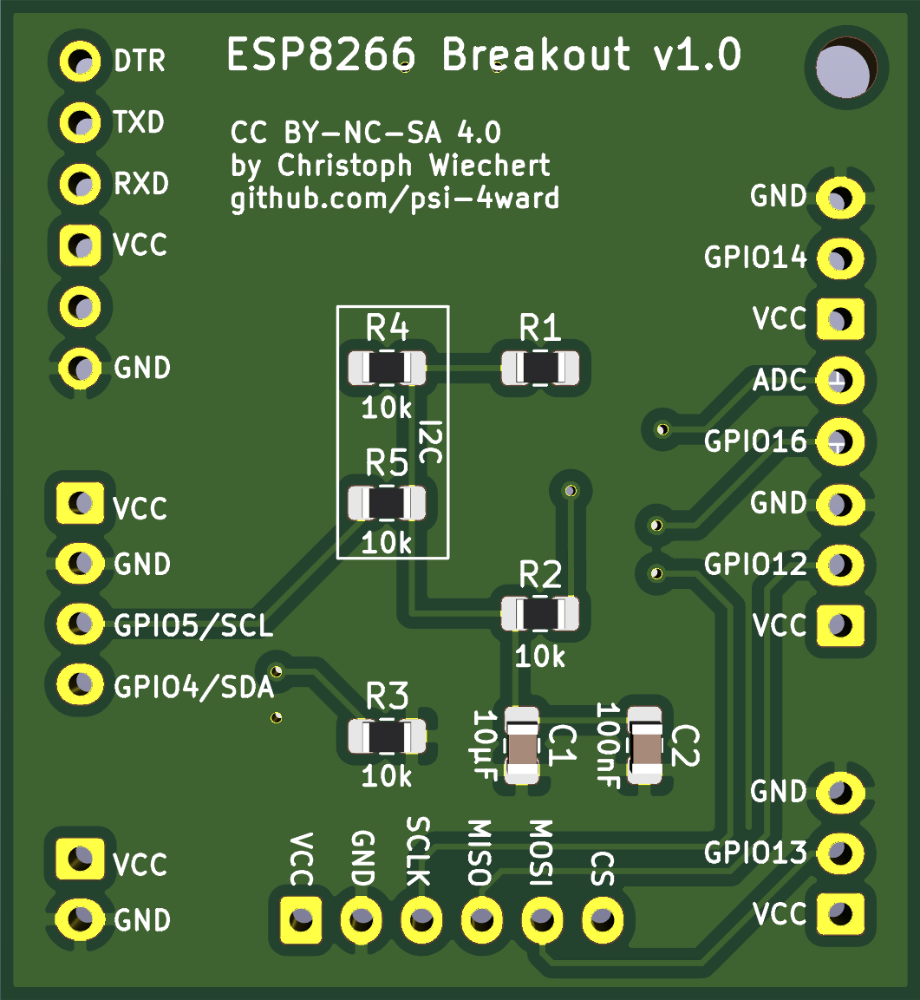

# ESP8266 Breakout Board

Simple breakout PCB für ESP8266.

* SMD Parts: 0805 handsolder
* Push-Buttons: 3x6x2,5mm

PS: If you're living in germany and need some PCBs contact me :)

### License
CC BY-NC-SA 4.0 
